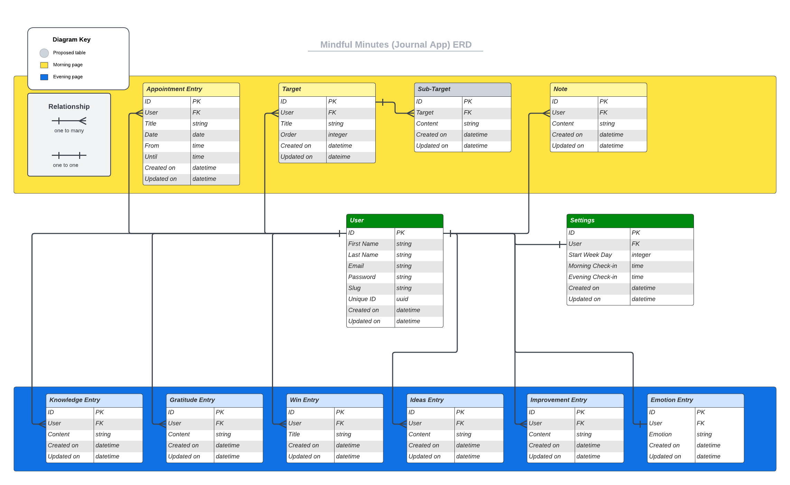

<!-- omit from toc -->

# Mindful Minutes

[](https://github.com/halfpintutopia/mindful-minutes/actions/workflows/github-ci-cd.yml)

<!-- omit from toc -->

## Table of Contents

- [Product Information](#product-information)
- [UX / UI Design](#ux--ui-design)
    - [Design Thinking](#design-thinking)
    - [5 Planes of Design](#5-planes-of-design)
    - [Future Implementations](#future-implementations)
    - [Accessibility](#accessibility)
- [Technologies Used](#technologies-used)
    - [Stack](#stack)
    - [Packages](#packages)
    - [Frameworks, Libraries \& Additional Programs/Software used](#frameworks-libraries--additional-programssoftware-used)
        - [Libraries](#libraries)
- [Remote \& Local Deployment](#remote--local-deployment)
    - [Remote Deployment](#remote-deployment)
        - [Create Heroku App (via the Dashboard)](#create-heroku-app-via-the-dashboard)
        - [Create a new PostgreSQL Database Instance](#create-a-new-postgresql-database-instance)
        - [Set up Heroku Config Vars](#set-up-heroku-config-vars)
    - [Local Deployment](#local-deployment)
    - [Contributing](#contributing)
- [Data Models](#data-models)
    - [Schematics](#schematics)
- [Testing](#testing)
    - [Django Test Driven Development using REST Framework](#django-test-driven-development-using-rest-framework)
    - [User experience](#user-experience)
    - [Bugs \& Fixes](#bugs--fixes)
    - [Lighthouse](#lighthouse)
    - [Validator Testing](#validator-testing)
- [Credits](#credits)
    - [References](#references)
    - [Code Used](#code-used)
    - [References \& Resources](#references--resources)
        - [Agile](#agile)
        - [Deployment](#deployment)
        - [CI / CD](#ci--cd)
        - [Django](#django)
        - [Django Testing](#django-testing)
            - [Automated testing](#automated-testing)
        - [Django](#django-1)
        - [Performance and Optimisation](#performance-and-optimisation)
    - [Content](#content)
    - [Media](#media)
    - [Acknowledgements](#acknowledgements)

## Product Information

The app is designed to help cultivate a habit of daily introspection and self-reflection. By using the app, the user can
establish a routine of engaging with their thoughts, goals and achievements every current day and evening.

The primary goal of the Mindful Minutes App is to encourage users to build a habit of checking in daily and reflecting
on their experiences. To reinforce this habit, the app allows users to create, edit, delete and access their current
day's journal entries while keeping the previous days' entries in a read-only mode. This approach ensures that users
focus on the present, fostering a send of mindfulness and self-awareness.

## UX / UI Design

For further details of the design process, please see:

### [Design Thinking](docs/ui-ux/design-thinking/design-thinking.md)

### [5 Planes of Design](docs/ui-ux/five-planes/five-planes.md)

### Future Implementations

Personalise experience:

- [How to use ChatGPT as a Personalized Mantra Generation for Meditation](https://chatgptschool.org/how-to-use-chatgpt-as-a-personalized-mantra-generator-for-meditation-2/)

### Accessibility

## Technologies Used

### Stack

- HTML5
- CSS3
- JavaScript
- Python

### Packages

- [CKEditor](https://ckeditor.com/)
    - Used this editor, rather than [Summernote](https://summernote.org), due to conflict with Django version. I
      previously worked with CKEditor when I worked with ConcreteCMS

### Frameworks, Libraries & Additional Programs/Software used

- Django

#### Libraries & Dependencies

- [Black](https://black.readthedocs.io/)
- [DJ-Database-URL](https://pypi.org/project/dj-database-url/)
    - Generates the proper database configuration dictionary for the Django settings based on the `DATABASE_URL`
      environment variable
- [Gunicorn](https://gunicorn.org/)
    - A production-grade WSGI server
- [Django All Auth](https://django-allauth.readthedocs.io/en/latest/)
- [pytest-xdist](https://pypi.org/project/pytest-xdist/)

```
# install packages
pip install <package_name>

# uninstall packages
pip uninstall <package_name>

# update requirements.txt file
pip freeze --local > requirements.txt
```

## Remote & Local Deployment

[Agile User Story Master on Google Sheets](https://docs.google.com/spreadsheets/d/1AhkEDuU5mDY9n6TMRGyk5BchJ2ijZUxiFlvbauW9HUE/edit?usp=sharing)
was created from a template supplied by our Cohort October 2022 Tutor, Rebecca Tracey-Timoney.

```shell
pip install django

pip install gunicorn # Server used to run Django on Heroku
```

### Remote Deployment

#### Create the Initial GitHub Actions Workflow YAML For CI/CD

The step-by-step instructions is mainly for continuous integration (CI) and continuous deployment (CD). It is intended
for remote deployment, specifically for deploying the Django application to Heroku.

The workflow assumes a Django project and code repository have been set up on GitHub, and Docker is being used for
containerisation. It leverages GitHub Actions for CI/CD and final deployment target is Heroku.

<details>
<summary><strong>1. Prerequisites</strong></summary>

Before creating the YAML file, ensure the following has been set up:

1. A Django project with version control hosted on GitHub
2. [Docker](https://docs.docker.com/get-docker/) installed on your development machine
3. [Docker Hub](https://hub.docker.com/) Account
   or [GitHub Container Registry (GHRC)](https://docs.github.com/en/packages/working-with-a-github-packages-registry/working-with-the-container-registry)
4. A [Heroku](https://heroku.com) account and a Heroku app created via
   the [GUI](https://devcenter.heroku.com/articles/heroku-dashboard)
   or [CLI](https://devcenter.heroku.com/articles/heroku-cli), for deployment

</details>

<details>
<summary><strong>2. Creating the Workflow File</strong></summary>

1. Create `.github/workflows` directory in the root of your project
2. Inside the `workflows` directory create a new file.

    ```shell
    mkdir -p .github/workflows 
    cd .github/workflows && touch django-ci-cd.yml
    ```
3. Open the file and add the following:

    ```yaml
    name: Django CI/CD # Name is arbitrary
    
    on:
      push:
        branches:
          - main
    
    env:
      IMAGE: ghrc.io/${{ github.repository }}/app:latest
    ```

</details>

---

##### Continuous Integration (CI)

- The `build` job responsible for building for Docker image and pushing it to a container registry (GHCR)
- The `test` job performs tests and code linting on the codebase to ensure it meets quality standards
    - The idea is to ensure that the codebase is tested and built into a Docker image in a consistent and reliable
      manner.

<details>
<summary><strong>3. Define the Build Job</strong></summary>

Add the `build` job to build and push the Docker image

```yaml
jobs:
  build:
    name: Build and Push Docker Image
    runs-on: ubuntu-latest

    steps:
      - name: Checkout codebase
        uses: actions/checkout@v3

      - name: Set up Python
        uses: actions/setup-python@v4
        with:
          python-version:3.11

      - name: Login to GitHub Container Registry
        run: echo "${{ secrets.GITHUB_TOKEN }}" | docker login ghcr.io -u "${{ github.actor }}" --password-stdin

      - name: Pull Docker image
        run: docker pull $IMAGE:latest || true

      - name: Build Docker image
        run: |
          cd app
          docker build
            --cache-from $IMAGE:latest
            --tag $IMAGE:latest
            --file ./Dockerfile.prod
            --build-arg SECRET_KEX=$SECRET_KEY
            .
          docker push $IMAGE:latest
```

- `ubuntu-latest`
    - provides an Ubuntu-based virtual machine
- `GITHUB_TOKEN`
    - a special token **automatically** provided by GitHub Actions to authenticate workflow when it runs
    - available as a built-in environment variable within GitHub Actions workflow
- `docker login`
    - authenticates Heroku's container registry using the `HEROKU_AUTH_TOKEN` secret
- `run: echo "${{ secrets.GITHUB_TOKEN }}" | docker login ghcr.io -u "${{ github.actor }}" --password-stdin`
    - the `echo` command is used to print the value of the GitHub token to the standard output
    - the `|` (pipe symbol) is used to redirect the standard output of the `echo` command as the input to
      the `docker login` command
- `$IMAGE`
    - environment variable set to the image name that includes the GitHub Container Registry (GHCR) URL (`ghcr.io`)
        - `docker pull $IMAGE:latest || true` - attempts to pull the latest version of the Docker image, if the pull
          fails the `|| true` ensures it doesn't cause the workflow to fail, allowing the workflow to proceed with
          the subsequent steps

</details>

<details>
<summary><strong>4. Define the Test Job</strong></summary>

Add the `test` job to run tests and code linting

```yaml
test:
  name: Test
  needs: build
  runs-on: ubuntu-latest

  services:
    - name: postgres-latest
      alias: postgres

  variables:
    DATABASE_TEST_URL: ${{ env.DATABASE_TEST_URL }}

  steps:
    - name: Checkout codebase
      uses: actions/checkout@v3

    - name: Set up Python
      uses: actions/setup-python@v4
      with:
        python-version: 3.11

    - name: Install dependencies
      run: pip install -r requirements.txt

    - name: Lint with Flake8, Black and isort
      run: |
        cd app
        pip install black==23.3.0 flake8==6.0.0 isort==5.12.0 pytest==7.2.2
        pytest -p no:warnings
        flake8 .
        isort . --check-only --skip env
        black . --check --exclude=migrations|venv
```

- `ubuntu-latest`
    - provides an Ubuntu-based virtual machine
- `needs`
    - specify the job that is required to have run successfully before it runs this job
- `services`
    - set up a Postgres container for the job
- `DATABASE_TEST_URL`
    - an environment variable, which connects the Django tests to the Postgres container
- `install -r requirements.txt`
    - installs the required Python dependencies for testing and deployment

</details>

---

##### Continuous Deployment (CD)

- The `deploy` job deploys the Docker image to Heroku, effectively deploying your Django application to production
    - The workflow uses the Heroku container registry to push and deploy the Docker image to Heroku's infrastructure

<details>
<summary><strong>5. Define the Deploy Job</strong></summary>

Add the `deploy` job to deploy to Heroku

```yaml
deploy:
  name: Deploy to production
  needs: test
  runs-on: ubuntu-latest

  steps:
    - name: Checkout codebase
      uses: actions/checkout@v3

    - name: Set up Python
      uses: actions/setup-python@v4
      with:
        python-version: 3.11

    - name: Deploy to Heroku
      env:
        HEROKU_APP_NAME: mindful-minutes
        HEROKU_REGISTRY_IMAGE: registry.heroku.com/${HEROKU_APP_NAME}/web
      run: |
        cd app
        docker build
          --tag $HEROKU_REGISTRY_IMAGE
          --file ./Dockerfile.prod
          --build-arg SECRET_KEY=$SECRET_KEY
          .
        docker login -u _ -p ${{ secrets.HEROKU_AUTH_TOKEN }} registry.heroku.com
        docker push $HEROKU_REGISTRY_IMAGE
        chmod +x ./release.sh
        ./release.sh
```

- `ubuntu-latest`
    - provides an Ubuntu-based virtual machine
- `needs`
    - specify the job that is required to have run successfully before it runs this job
- `env`
    - specifies the Heroku app name and image registry URL for Heroku deployment
- `docker login`
    - authenticates Heroku's container registry using the `HEROKU_AUTH_TOKEN` secret

</details>

<details>
<summary><strong>6. GitHub Secrets and Variables</strong></summary>

1. Go to the repository page
2. Navigate to "Settings"
3. Under "Settings and variables" listed on the left side menu, click "Actions"
4. Click "New repository secret"
5. Add the following secrets:
    - `HEROKU_AUTH_TOKEN`
        - Copy the Heroku API Key from your ["Account" page](https://dashboard.heroku.com/account) or use CLI to create
          one
   ```shell 
    heroku authorizations:create
    ```

</details>

<details>
<summary><strong>7. Commit and Push</strong></summary>

1. Save the `YAML` file
2. Commit changes
3. Push to GitHub repository

</details>

<details>
<summary><strong>8. Enable GitHub Actions</strong></summary>

[//]: # (TODO Add description)

</details>

<details>
<summary><strong>9. Configuring Heroku</strong></summary>

Before deploying to Heroku, make sure you have set up your Heroku app correctly and have obtained
the `HEROKU_AUTH_TOKEN` secret

1. Create a new app on Heroku for you Django project
2. Obtain the Heroku API Token from your Heroku account settings and add it as a secrete in your GitHub repository
   name `HEROKU_AUTH_TOKEN`

</details>

---

#### Set Up GitHub Actions Workflow YAML For CI/CD After Cloning

<details>
<summary><strong>1. Prerequisites</strong></summary>

1. A [GitHub](https://github.com/) account
2. A [Heroku](https://heroku.com) account

</details>

<details>
<summary><strong>2. Fork the Repository</strong></summary>

See [Fork the Repository](#fork-the-repository)

</details>

<details>
<summary><strong>3. Set Up GitHub Secrets</strong></summary>

1. Go to the repository page
2. Navigate to "Settings"
3. Under "Settings and variables" listed on the left side menu, click "Actions"
4. Click "New repository secret"
5. Add the following secrets:
    - `HEROKU_AUTH_TOKEN`
        - Copy the Heroku API Key from your ["Account" page](https://dashboard.heroku.com/account) or use CLI to create
          one
   ```shell 
    heroku authorizations:create
    ```

</details>

<details>
<summary><strong>4. Configure Heroku</strong></summary>

1. Login to [Heroku](https://heroku.com) account
2. Create a new Heroku app using the GUI or [CLI](https://devcenter.heroku.com/articles/creating-apps)
   ```shell
    heroku create <name>
    ```
3. Take note of the Heroku app name as this will be used for the deployment setup

</details>

<details>
<summary><strong>5. Modify the Workflow YAML File</strong></summary>

1. Open the `YAML` file located in `.github/workflows`
2. Go the `deploy` job and replace the `HEROKU_APP_NAME: mindful-minutes` with the Heroku app name you created.

</details>

<details>
<summary><strong>6. Trigger the Workflow & Verify Deployment</strong></summary>

1. Commit changes
2. Push changes to `main` branch of your forked repository, this will trigger the GitHub Actions workflow
3. Go to GitHub Repository page and click the "Actions" tab to see the workflow running,
    - build the Docker image
    - run tests
    - deploy the Docker image to Heroku (if the tests are passed)
4. After the workflow completes successfully, go to Heroku app's URL to verify the application has been deployed and
   running correctly

</details>

---

Install `python-dotenv` package with `pip install python-dotenv`
Create a `.env` file at the root of the project with the following keys

```
SECRET=<YOUR_SECRET_KEY>
DATABASE_URL=<ELEPHANTSQL_URL>
DEVELOPMENT=<SET TO 'True' if in development mode or remove or set to 'False' for production>
```

#### Create Heroku App (via the Dashboard)

[heroku _create_app.webm](https://github.com/halfpintutopia/mindful-minutes/assets/30613818/17142ef0-b723-4652-a0a9-53acdbcd5ce9)

1. Login
2. From the Dashboard, click the "New" button
3. Choose "Create new app" from the drop-down menu
4. Give the app a unique name, it *must* be unique otherwise Heroku complains
5. Choose the region appropriate to you
6. Click the "Create app" button

#### Create a new PostgreSQL Database Instance

[elephantsql_database_instance.webm](https://github.com/halfpintutopia/mindful-minutes/assets/30613818/e061fe61-76db-4157-b7cf-c7e720e2783e)

1. Login
2. Click the "Create New Instance" button
3. Set up a plan
    - Provide a name
    - Select the _Tiny Turtle (Free)_ plan
    - Add tags if needed
4. Click the "Select Region" button
    - Choose the data centre closest to you
5. Click the "Review" button
6. Click the "Create instance" button
7. From the list of instances on your dashboard, click the name of the new instance
8. Copy the URL from the "Details" page and paste this link into your settings.py file in your Django project

#### Set up Heroku Config Vars

[heroku _config_vars.webm](https://github.com/halfpintutopia/mindful-minutes/assets/30613818/d19dd102-eab2-4750-a5ee-0963ad7039be)

1. Login
2. Go to the project and click on the Settings tab
3. Go to the "Config Vars" section and add the following variables:
    - DATABASE_URL
    - SECRET_KEY
    - PORT
    - CLOUDINARY_URL

DISABLE_COLLECT_STATIC 1

### Local Deployment

#### Fork the Repository

##### Configuration steps

1. Docker Registry
    - Set up a Docker registry on Docker Hub
2. Docker Registry Image
    - Name and tag Docker image for project, with the following format:
        - `registry-url/username/repo-name:tag` (e.g. `docker.io/username/project:latest`)
3. GitHub Repository
    - Set up repo secrets
        - Go to "Settings" and under "Secrets and variables", click on "Actions"
        - Create a secret for `DOCKER_REGISTRY_IMAGE`. Set this to the Docker Registry Image name and tag set in Step 2
    - Create a new `YAML` file in the located in the `.github/workflows` directory located in the root of the repo

### Contributing

## Data Models

### Schematics

 created
with [LucidChart](https://lucid.app).

Considered creating a base model or mixin as models most of the models contained the same fields e.g.

```python
# Creating the base model to be inherited by models
class BaseModel(models.Model):
    field_1 = models.CharField(max_length=50)
    field_2 = models.IntegerField()
    field_3 = models.TimeField()

    class Meta:
        abstract = True


# implementation of BaseModel by inheritance as follows:
class ModelOne(BaseModel):
    additional_field_1 = models.TextField()


# Creating the mixin to be reused by models
class MixinModel(models.Model):
    field_1 = models.CharField(max_length=50)
    field_2 = models.IntegerField()
    field_3 = models.TimeField()

    class Meta:
        abstract = True


# implementation of reusing the MixinModel
class ModelTwo(MixinModel):
    additional_field_1 = models.TextField()
```

As the models had the exactly the same fields with not additional fields or behaviours, I chose to keep the models
separate. Having individual models allows for clarity and simplicity as well as making it more maintainable, as then the
codebase is more flexible to evolve independently.

## Testing

### Django Test Driven Development using REST Framework

For further details on testing, click [here](docs/testing/testing.md).

### User experience

[Browserstack](https://www.browserstack.com) was used for testing. The devices were:

### Bugs & Fixes

### Lighthouse

### Validator Testing

- [CI Python Linter](https://pep8ci.herokuapp.com/)

## Credits

### References

- [Add 'go to top' button on Readme.md](https://github.com/orgs/community/discussions/42712)
- [How to Create Reusable SVG Icon React Components](https://www.freecodecamp.org/news/how-to-create-reusable-icon-react-components-for-colors-and-sizes-customization/)
- [Help with snapping nodes to guidelines](https://alpha.inkscape.org/vectors/www.inkscapeforum.com/viewtopic6b46.html?t=18613)
- [Adobe Express - Convert your image to an SVG for free](https://www.adobe.com/express/feature/image/convert/svg)
- [CodePen|The Hamburger Menu by Matthew Blode](https://codepen.io/mblode/pen/YzozOm)
- [CodePen|🍔 <-> ❌ (version 1) by Tomino Martinius](https://codepen.io/Zaku/pen/vYReWM)
- [CodePen|Menu "Hamburger" Icon Animations by Jesse Couch](https://codepen.io/designcouch/pen/ExvwPY)
- [Getting started with Variable fonts on the web - Kevin Powell](https://www.youtube.com/watch?v=0fVymQ7SZw0) **
- [Figma Dev Mode is here! - Kevin Powell](https://www.youtube.com/watch?v=063yVWoQvoY)
- [Responsive navbar tutorial using HTML CSS & JS - Kevin Powell](https://www.youtube.com/watch?v=HbBMp6yUXO0)
- [Support CSS Nesting Module](https://youtrack.jetbrains.com/issue/WEB-57875)
- [Can I Use CSS Nesting](https://caniuse.com/css-nesting)
- [Adobe Color - Lab](https://color.adobe.com/color-labs/recolor-svg)

#### Definitions

- Web Dyno
    - a lightweight Linux container used to run a single process, sucha as a web server or a background worker. Dynos
      are the building blocks of a Heroku application's runtime environment. It refers to the dyno responsible for
      handling incoming HTTP requests for you web application. It runs the web server specified in the Dockerfile. 

### Code Used

### References & Resources

- [Remix Icon - Simply Delightful Icon System](https://remixicon.com/)

#### Additional Courses

- [Test-Driven Development with Django, Django REST Framework and Docker](https://testdriven.io/courses/tdd-django)
- [Full Stack for Front-End Engineers, v3 - Jem Young](https://frontendmasters.com/courses/fullstack-v3/)
- [Complete Intro to SQL & PostgreSQL - Brian Holt](https://frontendmasters.com/courses/sql/)
- [Complete Intro to Containers - Brian Holt](https://frontendmasters.com/courses/complete-intro-containers/)

#### Agile

- [Agile User Story Template Spread Sheet, resource provided by Rebecca Tracey-Timoney](https://docs.google.com/spreadsheets/d/1E87iXrwStqmuy0DatpK8e-pD3ygBqotS91npelTbVVs/edit?usp=sharing)
- [Project Management on GitHub](https://www.topcoder.com/thrive/articles/project-management-on-github)
- [Acceptance Criteria for User Stories: Purposes, Formats, Examples, and Best Practices](https://www.altexsoft.com/blog/business/acceptance-criteria-purposes-formats-and-best-practices/)
- [User stories with examples and a template](https://www.atlassian.com/agile/project-management/user-stories)
- [Define features and epics, organize your product and portfolio backlogs in Azure Boards](https://learn.microsoft.com/en-us/azure/devops/boards/backlogs/define-features-epics?view=azure-devops&tabs=agile-process)
- [Chapter 15: Requirements and user stories](https://www.agilebusiness.org/dsdm-project-framework/requirements-and-user-stories.html)
- [Epics, User Stories, Themes, and Initiatives: The Key Difference and Examples](https://www.altamira.ai/blog/difference-between-epics-vs-user-stories/)
- [How to Write a Good User Story: with Examples & Templates](https://stormotion.io/blog/how-to-write-a-good-user-story-with-examples-templates/)
- [Epics vs. User Stories: what’s the difference?](https://www.delibr.com/post/epics-vs-user-stories-whats-the-difference)

#### Deployment

- [Heroku Dev Center - The Heroku CLI](https://devcenter.heroku.com/articles/heroku-cli)
- [How to use Environment Variables in Django](https://codinggear.blog/django-environment-variables/)
- [Django Deployment checklist](https://docs.djangoproject.com/en/4.1/howto/deployment/checklist/)

##### Issues / Bugs

- [Error saving credentials: error storing credentials - err: exit status 1, out: `error getting credentials - err: exit status 1](https://stackoverflow.com/questions/71770693/error-saving-credentials-error-storing-credentials-err-exit-status-1-out)
- [How to make isort black compatible. Original Question: isort conflicts with black?](https://github.com/PyCQA/isort/issues/1518)
- [Configuration via a file](https://black.readthedocs.io/en/stable/usage_and_configuration/the_basics.html#configuration-via-a-file)
- [How can I stop black formatter from formatting migrations files of a Django project?](https://www.reddit.com/r/django/comments/w1qgyn/how_can_i_stop_black_formatter_from_formatting/)
- [Pushed docker image to registry.heroku.com via Github actions but it doesn't show up anywhere? ](https://www.reddit.com/r/Heroku/comments/tdyx2x/comment/i0sz50k/)
- [H14 error in heroku - "no web processes running"](https://stackoverflow.com/questions/41804507/h14-error-in-heroku-no-web-processes-running)
- [Causes of Heroku H10-App Crashed Error And How To Solve Them](https://dev.to/lawrence_eagles/causes-of-heroku-h10-app-crashed-error-and-how-to-solve-them-3jnl)

#### CI / CD

- [GitHub Actions in action - Setting up Django and Postgres](https://www.hacksoft.io/blog/github-actions-in-action-setting-up-django-and-postgres#psycopg2-dependencies-no-longer-needed-)
- [GitHub Actions - Create starter workflows](https://docs.github.com/en/actions/using-workflows/creating-starter-workflows-for-your-organization)
- [Schedule Planner Repository](https://github.com/halfpintutopia/schedule-planner/blob/master/.gitlab-ci.yml)
- [Pushing container images to GitHub Container Actions](https://dev.to/willvelida/pushing-container-images-to-github-container-registry-with-github-actions-1m6b)
- [Postgres - Docker Hub](https://hub.docker.com/_/postgres)
- [GitHub Actions - Automate your GitHub workflows](https://github.com/actions)
- [GitHub Action: Ubuntu-latest workflows will use Ubuntu-22.04](https://github.blog/changelog/2022-11-09-github-actions-ubuntu-latest-workflows-will-use-ubuntu-22-04/)
- [Heroku Dev Center - Container Registry & Runtime (Docker Deploy)](https://devcenter.heroku.com/articles/container-registry-and-runtime)
- [Creating PostgreSQL service containers](https://docs.github.com/en/actions/using-containerized-services/creating-postgresql-service-containers)
- [This is a good starting point getting Python, Django, Postgres running as a service, pytest, black and pip caching rolling with GitHub Actions](https://gist.github.com/jefftriplett/d35e120ef9884bcff61c5ade0740f52d)
- [Setup postgres in GitHub Actions for Django](https://stackoverflow.com/questions/63066240/setup-postgres-in-github-actions-for-django)
- [GitHub Actions - Variables](https://docs.github.com/en/actions/learn-github-actions/variables)
- [How to connect to Postgres in GitHub Actions](https://stackoverflow.com/questions/57915791/how-to-connect-to-postgres-in-github-actions)
- [Deploy Django application to Heroku with GitHub Actions](https://medium.com/@raynoldw222/deploy-applications-to-heroku-with-github-actions-21f5406482ff)

#### Django

- [Django Documentation](https://docs.djangoproject.com)
- [Test-Driven Development with Django, Django REST Framework and Docker](https://testdriven.io/courses/tdd-django)
- [Django Girls Tutorial](https://tutorial.djangogirls.org/en/)
- [Getting the Most Out of the Django's User Model](https://www.youtube.com/watch?v=sXZ3ntGp_Xc)
- [Django - Extend User Model](https://simpleisbetterthancomplex.com/tutorial/2016/07/22/how-to-extend-django-user-model.html)

##### Python Dependencies / Packages

- [How to Auto-Format Your Python Code with Black](https://www.freecodecamp.org/news/auto-format-your-python-code-with-black/)

#### Heroku

- [How should I generate an API key that allows me to use Heroku Platform API?](https://help.heroku.com/PBGP6IDE/how-should-i-generate-an-api-key-that-allows-me-to-use-the-heroku-platform-api)
- [Getting Started with the Platform API](https://devcenter.heroku.com/articles/platform-api-quickstart)
- [Heroku CLI Authentication](https://devcenter.heroku.com/articles/authentication)
- [Heroku CLI Commands](https://devcenter.heroku.com/articles/heroku-cli-commands)

#### Testing

##### Automated testing

- [Creating a Custom User Model in Django](https://testdriven.io/blog/django-custom-user-model/)
- [Testing Models with Django using Faker and Factory Boy](https://medium.com/analytics-vidhya/factoryboy-usage-cd0398fd11d2)
- [Pytest for Beginners](https://testdriven.io/blog/pytest-for-beginners/)
- [Pytest](https://docs.pytest.org/en/latest/getting-started.html)
- [Testing in Django with Selenium](https://ordinarycoders.com/blog/article/testing-django-selenium)
- [How to authorize user in Django testing REST framework APIClient post method](https://stackoverflow.com/questions/70967642/how-to-authorize-user-in-django-testing-rest-framework-apiclient-post-method)
- [Freezegun](https://github.com/spulec/freezegun)
- [Pycharm|Pytest](https://www.jetbrains.com/help/pycharm/pytest.html)

#### Django

- [Effectively Using Django REST Framework Serializers](https://testdriven.io/blog/drf-serializers/)
- [Introduction to Django Channels](https://testdriven.io/blog/django-channels/)
- [Migrating a Custom User Model Mid-Project in Django](https://testdriven.io/blog/django-custom-user-model-migration/)
- [Customize Django Admin](https://earthly.dev/blog/customize-django-admin-site/)

#### Performance and Optimisation

- [A Guide to Performance Testing and Optimization with Python and Django](https://medium.com/designcentered/ux-design-5-planes-method-b1b1d6587c05)
- [Scaling Django Applications: Best Practices and Strategies](https://medium.com/ux-diaries/imdb-website-redesign-ux-case-study-c42f65a69b98)

### Content

### Media

### Acknowledgements

Thanks to Adam Gilroy for giving me permission to use his LinkedIn Post as inspiration for a Use Case.

[Back to the top](#mindful-minutes)
