<!-- omit from toc -->
# 5 Planes of Design

[*Return to main README file*](../../../README.md)

[Design Thinking](../design-thinking/design-thinking.md) provided the creative and exploratory aspect of the design process, in continuation the 5 Planes of Design framework structures and evaluates the design solution across different dimensions. Using the data provided from the [Design Thinking](../design-thinking/design-thinking.md) approach, here is the summary of generated and innovative ideas and concepts that were further refined and shaped into a well-considered and holistic design solution.

<!-- omit from toc -->
## Table of Contents
- [1. Strategy Plane](#1-strategy-plane)
  - [Target Audience](#target-audience)
  - [User \& Client Needs](#user--client-needs)
  - [Opportunity Matrices](#opportunity-matrices)
- [2. Scope Plane](#2-scope-plane)
- [3. Structure Plane](#3-structure-plane)
  - [Information Architecture \& User Journey](#information-architecture--user-journey)
    - [User Management](#user-management)
    - [Admin Management](#admin-management)
    - [Repo Management](#repo-management)
- [4. Skeleton Plane](#4-skeleton-plane)
  - [Home page](#home-page)
  - [Features](#features)
    - [Forms](#forms)
    - [Morning page (and Evening page)](#morning-page-and-evening-page)
    - [My profile page](#my-profile-page)
  - [Navigational Map](#navigational-map)
- [5. Surface Plane](#5-surface-plane)
  - [Imagery](#imagery)
  - [Colour Palette](#colour-palette)
  - [Typography](#typography)
  - [Mock-ups](#mock-ups)
    - [Home page](#home-page-1)
    - [Forms](#forms-1)
    - [Morning page (and Evening page)](#morning-page-and-evening-page-1)
    - [Search page](#search-page)
    - [My profile page](#my-profile-page-1)
  - [References:](#references)
    - [Methodology](#methodology)
    - [Images within Mock-ups:](#images-within-mock-ups)
    - [Design Inspiration:](#design-inspiration)

## 1. Strategy Plane

### Target Audience

The following sections provide an overview of the target audience for the Mindful Minutes (Journal App). Further research and user surveys were taken to gather more specific insights and refined the target audience description. This helped tailor the app's features, user experience and content to meet the needs and preferences of the identified target audience.

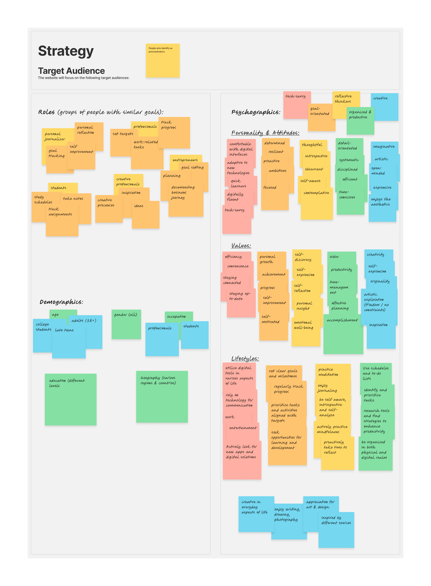

  
Roles (groups of people with similar goals)

- Personal Journalisers
  - Individuals who use the app for:
    - personal reflection
    - goal tracking
    - self-improvement
- Professionals
  - Individuals who use the app for:
    - work-related task
    - set targets
    - track progress
- Students
  - Individuals who use the app for:
    - study schedules
    - track assignments
    - take notes
- Creative (Professionals)
  - Individuals who use the app for:
    - take ideas
    - take inspiration
    - track creative process
- Entrepreneurs
  - Individuals who use the app for:
    - planning
    - goal setting
    - documenting business journey

  
Demographics

- Age
  - for adults (18+)
  - older teenagers
  - college students
- Gender
  - all genders
- Occupation
  - various professional backgrounds i.e.
    - corporate employees
    - freelancers
    - students
    - entrepreneurs
- Education
  - different levels of education i.e.
    - high school
    - graduates
    - university-educated individuals
- Geography
  - various regions or countries

  
Psychographics

1. Tech-savvy
  - Personality & Attributes
    - tech-savvy
    - digitally fluent
    - adaptive to new technologies
    - comfortable with digital interfaces
    - quick learners
  - Values
    - efficiency
    - convenience
    - staying connected
    - staying up-to-date with technology
  - Lifestyles:
    - embrace digital tools in various aspects of life
    - rely on technology for communication
    - work
    - entertainment
    - actively seeking new apps for digital solutions
2. Goal Orientated
  - Personality & Attributes
    - ambitious
    - determined
    - focused
    - proactive
    - resilient
  - Values
    - personal growth
    - achievement
    - progress
    - self-improvement
    - self-motivation
  - Lifestyles
    - set clear goals and milestones
    - prioritise tasks and activities aligned to goals
    - regularly track progress
    - seek opportunities for learning and development
3. Reflective Thinkers
  - Personality & Attributes
    - thoughtful
    - introspective
    - observant
    - self-aware
    - contemplative
  - Values
    - self-discovery
    - self-expression
    - self-reflection
    - personal insight
    - emotional well-being
  - Lifestyles
    - engage in journaling
    - engage in mediation
    - engage in mindfulness practices
    - value alone time for reflection
    - seeks moments of introspection and self-analysis
4. Organised and Productive
  - Personality & Attributes
    - detail orientated
    - systematic
    - disciplined
    - efficient
    - time-conscious
  - Values
    - order
    - productivity
    - time management
    - effective planning
    - accomplishment
  - Lifestyles
    - rely on schedules and to-do lists
    - prioritise tasks
    - seek tools and strategies to enhance productivity
    - maintain an organised physical and digital environment
5. Creatively inclined
  - Personality & Attributes
    - imaginative
    - artistic
    - open-minded
    - expressive
    - inspired by aesthetics
  - Values
     - creativity
     - self-expression
     - originality
     - artistic exploration
     - inspiration
  - Lifestyles
    - engage in creative pursuits (writing, drawing, photography)
    - appreciate art and design
    - seek inspiration from various sources
    - incorporate creativity into daily life

---

### User & Client Needs

Based on the target audience, these are the user and client needs for the Mindful Minutes (Journal App).

The user and client needs provide a foundation for understanding the requirements and expectations for both users and the app owner (or developer). By addressing these needs, the app is designed to cater to the target audience effectively and meet client's objectives.

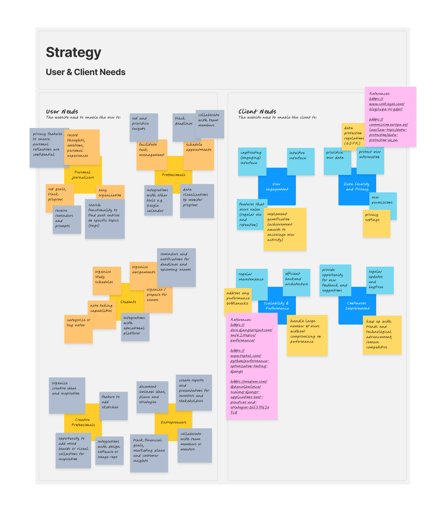

References on [Figma](http://figma.com) screenshot:
- [CCPA vs GDPR](https://www.cookieyes.com/blog/ccpa-vs-gdpr/)
- [Data Protection EU](https://commission.europa.eu/law/law-topic/data-protection/data-protection-eu_en)
- [Django Performance](https://docs.djangoproject.com/en/4.2/topics/performance/)
- [Performance Optimization Testing Django](https://www.toptal.com/python/performance-optimization-testing-django)
- [Scaling Django Application Best Practices and Strategies](https://medium.com/@danielbuilescu/scaling-django-applications-best-practices-and-strategies-1b537f62e5c8)

  
User Needs

- Personal Journalisers:
  - Enable users the ability to record:
    - thoughts
    - emotions
    - personal experiences
  - Set personal goals
  - Track progress
  - Receive reminders and prompts
  - Privacy features to ensure their personal reflections remain confidential
- Professional:
  - Facilitate task management
    - set and prioritise work-related targets
  - Be able to track deadlines
  - Collaborate with team members
  - Schedule appointments
  - Integration with productivity tools (e.g. Google Calendar)
  - Have reporting options to monitor their work progress, such as visualisation tools
- Students:
  - Able to assist students with organising:
    - schedules
    - assignments
    - exams
  - Able to take notes and categorise / tag notes by subject
  - Be able to set reminders and notifications to stay on top of deadlines or upcoming exams
  - Integration with educational platforms to enhance user experience
- Creative Professionals:
  - Capture and organise creative ideas (inspiration, visual content)
  - Features to enable user to sketch or annotate images
  - Ability to create mood boards or visual collections for inspiration
  - Integration with design software or image repositories
- Entrepreneurs:
  - Enable user to document business ideas, plan and strategies
  - Sections to track financial goals, marketing plans and customer insights
  - Collaboration with team members and mentors
  - Option to export and create reports and presentations for investors and stakeholders

  
Client Needs

- User engagement
  - Provide a captivating and intuitive interface to keep users engaged
  - Users should find value in the app's features, leading to regular usage and retention
  - Implement gamification elements / achievement rewards to encourage user activity
- Scalability and Performance
  - Be able to handle number of users without compromising performance
  - Efficient back architecture and database management
  - Regular maintenance and optimisation to address any performance bottlenecks
- Data Security and Privacy
  - Priority regarding user data security and implement appropriate measures to protect user information
  - Compliance with data protection regulations such as GDPR if applicable
  - User permission and privacy settings to allow users control over their data
- Continuous Improvement
  - Provide opportunities for user feedback
  - Regular updates and bugfixes to improve the app's functionality
  - Stay up-to-date with industry trends and technological advancements

---

### Opportunity Matrices

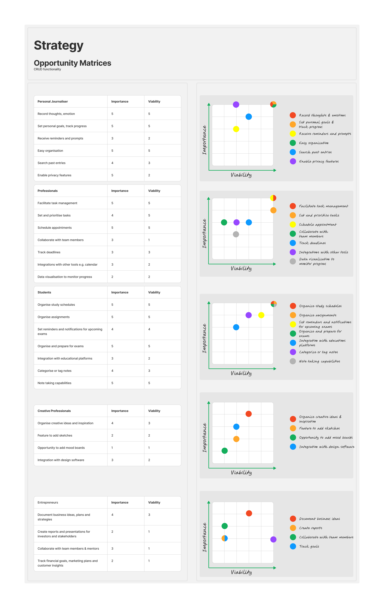

## 2. Scope Plane

The Scope Plane defines the overall boundaries and scope of the project, including the Content and Functionality Requirements.

The following content and functionality requirements help define the scope of the project and provide a clear understanding of what needs to be implemented to meet the objectives of the Mindful Minutes application. They serve has a foundation for subsequent stages of the design and development process. These are documented to ensure the final product meets expectations and needs of the users and clients.

  
Content Requirements

The content requirements refer to the specific content elements and information that need to be included in the project. These requirements define what type of content should be present and what information should be communicated to users. Content requirements include text, images, videos, documents and any other form of media or data.

- User generated journal entries with fields including:
  - title
  - date
  - content

- Sections for:
  - appointment diary
  - day targets
  - notes
  - what I have learnt
  - successes
  - wins
  - what I could do better
  - future ideas

- Customisable settings and preferences for user profiles

- Privacy settings to control the visibility of journal entries

- Integration with a repository for file uploads and storage

  
Functionality Requirements

The functionality requirements define specific features, actions and capabilities that the application should provide its users. These requirements focus on the desired functionality and behaviour of the application.

- User registration and authentication system

- Ability manipulate journal entries:
  - create
  - read
  - update
  - delete

- Search functionality to find specific journal entries

- Calendar integration for appointment scheduling

- Task management system with deadlines (and reminders)

- Collaboration features for shared journals and notes

- Reporting and analytics to track progress and achievements

- Admin management functionality to manage users, roles and permissions

## 3. Structure Plane

### Information Architecture & User Journey

#### User Management

The User is the main entry point in this Information Architecture. The User has access to various sections to the Mindful Minutes (Journal App) including:
- Login
- Appointment Diary
- Day Targets
- Note
- Successes
- Wins
- Improvements
- Ideas
- What I've Learnt

Each section represents a specific functionality or feature within the app that the User can interact with.

The simple User Journey represents the typical flow of actions for the User in interacting with the different sections of the Mindful Minutes (Journal App). The User can navigate through the sections, view, create or delete content as per their needs and preferences.

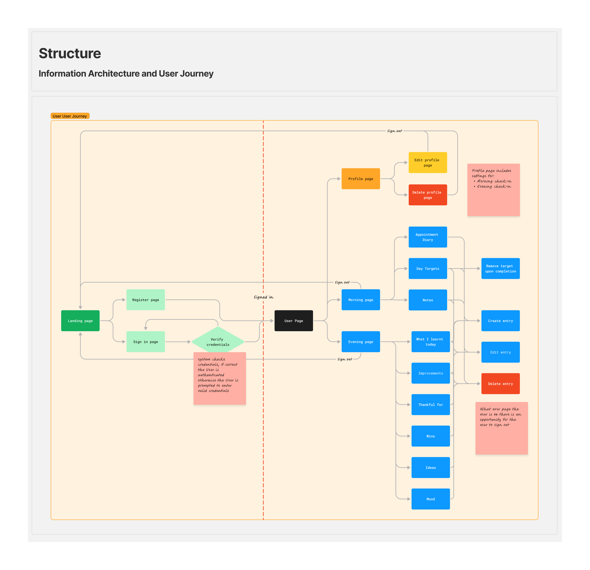

---

#### Admin Management

The Admin is the main entry point in this Information Architecture. The Admin has access to various sections of the Mindful Minutes (Journal App). The Admin has access to various sections of the app, including Login, Manage Users, Manage Content and Reports. Each section represents a specific functionality or feature within the app the Admin can manage.

The simple User Journey represents the typical flow of actions for the Admin in managing and interacting with the different sections of the Journal app. The Admin can navigate through the sections, perform CRUD (Create, Retrieve, Update, Delete) operations, manage user accounts and generate reports when necessary.

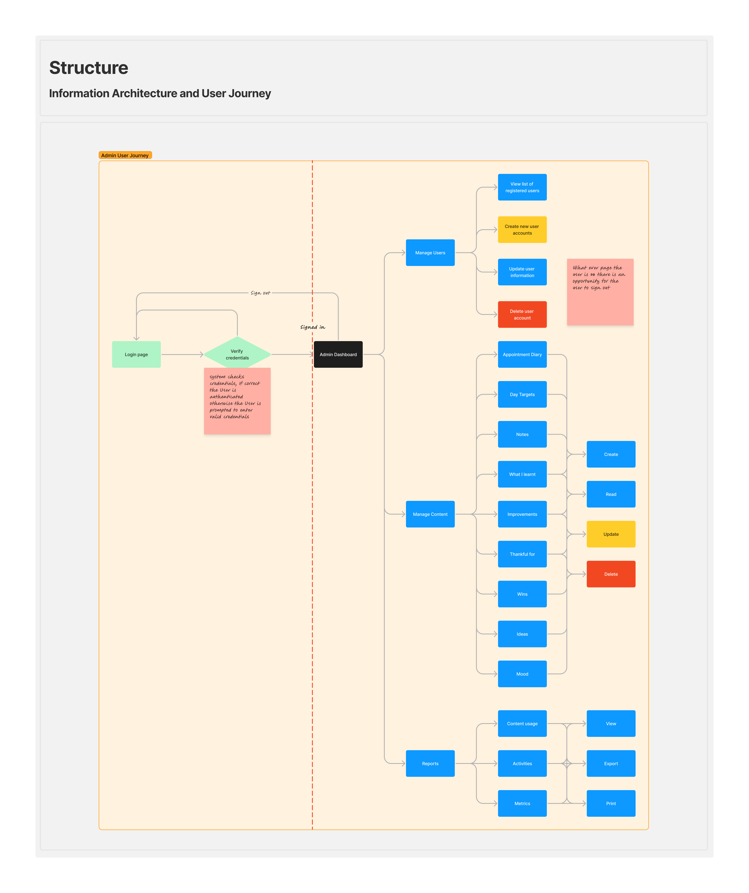

---

#### Repo Management

The Repository is the main component in this Information Architecture. The User Journey includes login to ensure secure access to the repository functionality for authorised users only.

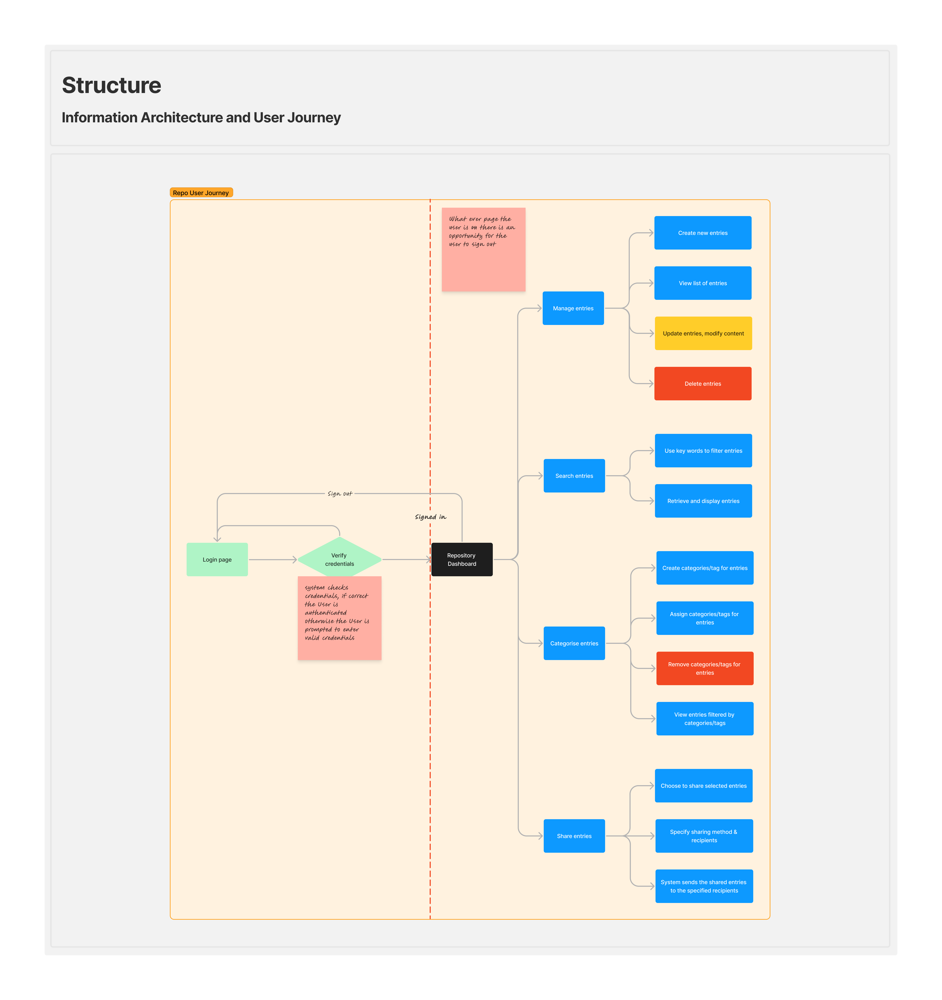

## 4. Skeleton Plane

The Skeleton Plan wireframes serve as the foundational blueprint for the visual layout and structure of the web application. It focuses on defining the overall composition of the pages, including the placement of key elements and sections. The wireframes provides a visual representation of the basic skeletal structure of the app's pages, guiding the subsequent design and development processes. It outlines the general arrangement of the header, content sections, and footer ensuring a consistent and user-friendly interface throughout the application.

### Home page

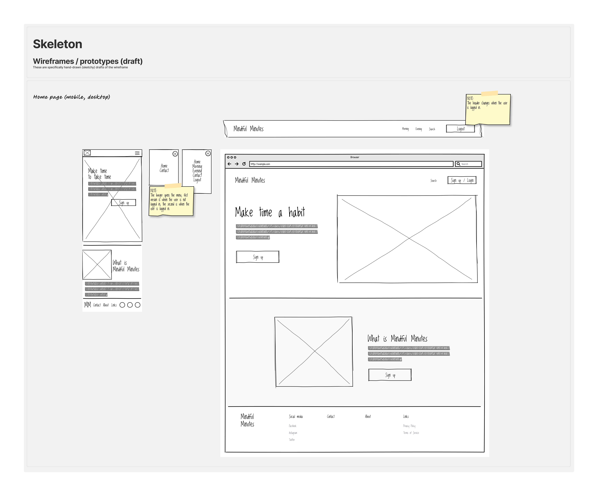

By keeping the home page clean and uncluttered, users can easily grasp the core concept of the app without overwhelming distractions. The about summary section provides a brief description of the app, highlighting its key features and benefits. To enhance user engagement and encourage interaction, each section includes a Call To Action (CTA) button. These CTAs prompt users to sign up for the app.

---

### Features

#### Forms

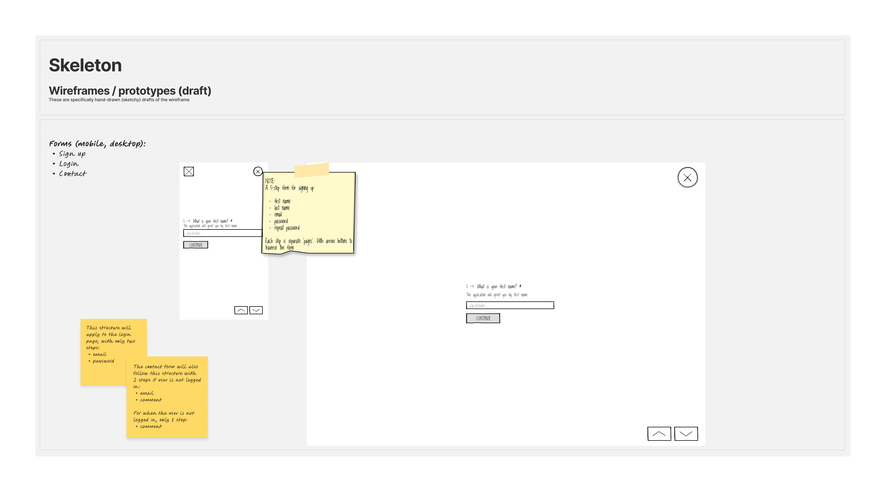

Dividing a form into steps can significantly enhance the user experience by providing clarity, reducing cognitive load, maintaining focus, improving error handling and increasing user engagement. Clear progress indicators so users can easily understand their progress and know how much they need to complete.

Types of forms:
- Sign up
- Login
- Contact form
  - Using a contact form rather than an email link was the chosen option to provide the user with a seamless experience allowing user to submit inquiries or feedback without leaving the app. Also, this allows users to feel confident in submitting inquiries as it offers privacy and security.

---

#### Morning page (and Evening page)

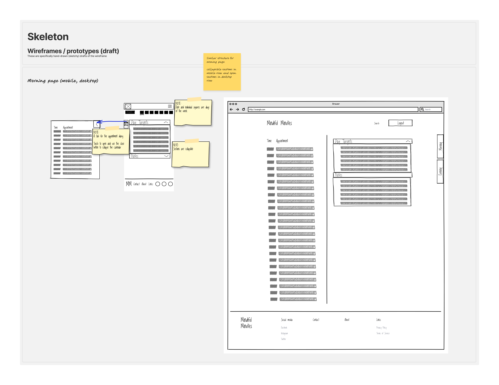

The decision to use collapsible sections on mobile devices while keeping them open and expanded on desktop is based on optimising the user experience for different screen sizes and device capabilities.

---

#### My profile page

The account settings remain simple and using the form structure during the initial onboarding process promotes a user-friendly experience, clear onboarding flow, efficiency in time and effort and reduced decision fatigue. It sets a solid foundation for users to get started quickly and enjoy the core features of the app.

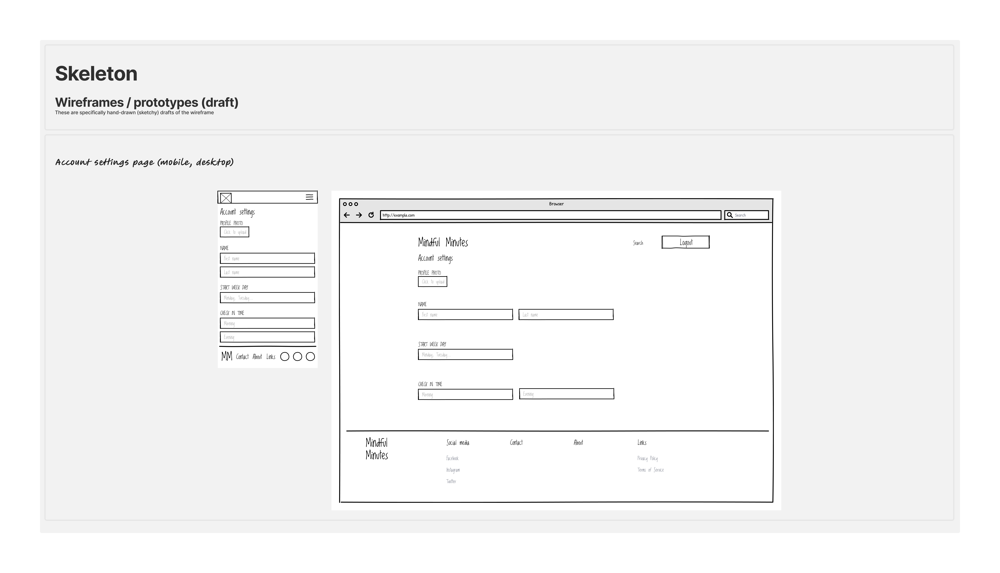

 The profile page is accessible and editable in this structure after the onboarding process.

---

### Navigational Map

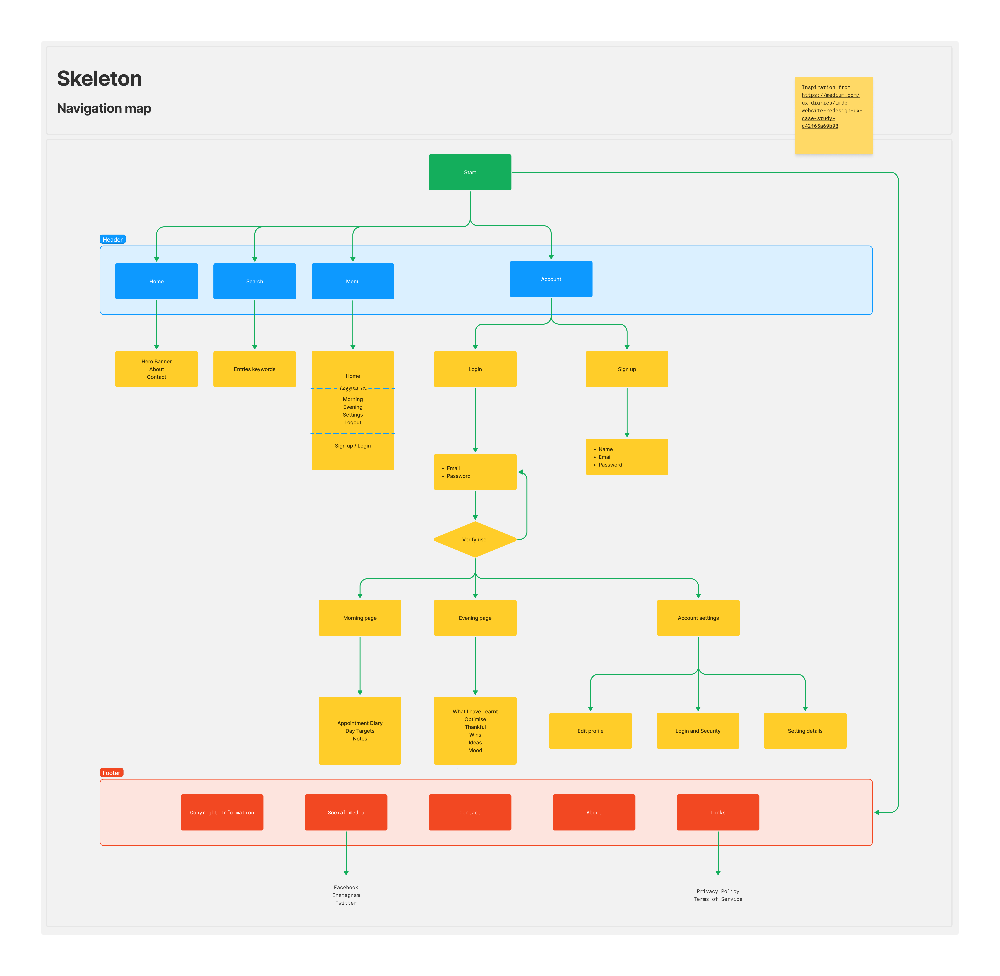

References:
- [IMDB Website Redesign: UX Case Study](https://medium.com/ux-diaries/imdb-website-redesign-ux-case-study-c42f65a69b98)

## 5. Surface Plane

### Imagery

Using [Unsplash](https://unsplash.com), with the keywords:

- peace
- mindfulness
- reflection
- journal
- diary

I gathered the selected images, to use as a reference to create a [Color Palette](#colour-palette).

Image references:

- [a black and white photo on a white wall by Annie Spratt](https://unsplash.com/photos/Bf9PT5qVZvM)
- [white printer paper beside black pen by Markus Spiske](https://unsplash.com/photos/IqVqS1V1ch8)
- [flat lane photo of book and highlighters by Estée Janssens](https://unsplash.com/photos/hb00NH1JXh0)
- [white notebook beside white ceramic mug on brown wooden table by Susan Weber](https://unsplash.com/photos/xcWd06vcsJo)
- [blue sky with white clouds by Jessica Delp](https://unsplash.com/photos/c7YYeMemTzw)
- [selective focus photo of pink petaled flowers by Kien Do](https://unsplash.com/photos/NjT4O7WYmwk)
- [body of water and snow-covered mountains during daytime by Tim Stief](https://unsplash.com/photos/YFFGkE3y4F8)
- [white and brown greeting card by Emily Park](https://unsplash.com/photos/jGjBDv06hDw)
- [white flowers in clear glass vase by Sixteen Miles Out](https://unsplash.com/photos/TN6kLg466Bc)
- [green and white sky by Marek Szturc](https://unsplash.com/photos/2s3fI3M1lO0)
- [orange flowers by Masaaki Komori](https://unsplash.com/photos/7xP5BJ34ybg)
- [black stones with sun in the distance b< Siim Lukka](https://unsplash.com/photos/C5tIVJaa-Ic)

---

### Colour Palette

From the Mood Board created under [Imagery](#imagery), I looked for predominant colours and colour combinations in the images that were visually appealing and aligned to the the Mindful Minutes' (Journal App) theme. Using [Adobe Color](https://color.adobe.com/create/color-wheel) to extract colours from [white notebook beside white ceramic mug on brown wooden table by Susan Weber](https://unsplash.com/photos/xcWd06vcsJo) taken from the Mood Board and create a cohesive colour palette.

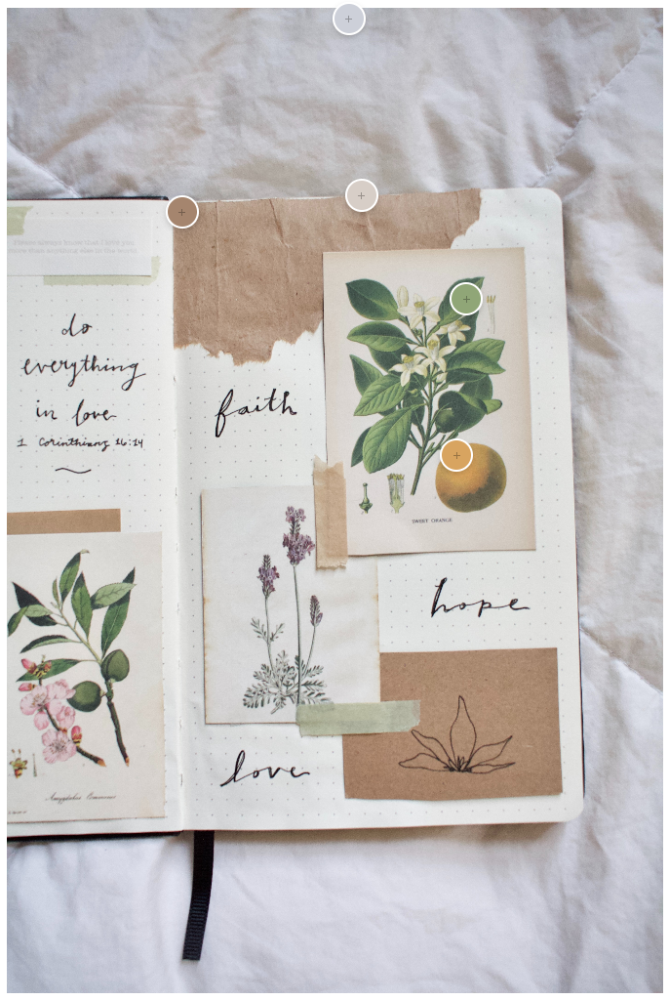

While considering the colours which would evoke the desired mood, other considerations regarding the application's user interface were:

- provide good contrast
- readability
- accessibility

---

### Typography

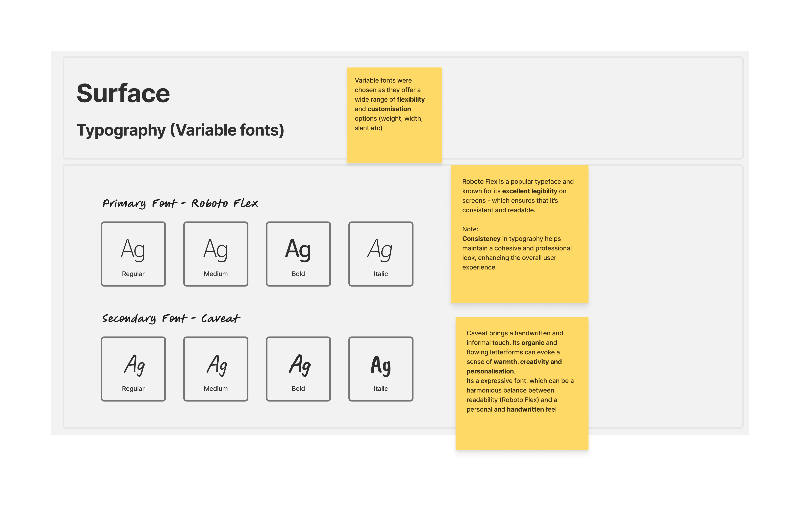

The combination of Roboto Flex and Caveat variant fonts in a journal app provides a balances between readability, customisation, elegance and personalisation. It allows for flexibility in typography, while maintaining consistency and enhancing the overall user experience.

References:
- [Responsive Web Typography v2 with Jason Pamental](https://frontendmasters.com/courses/responsive-typography-v2/)
- [Font Face Observer](https://fontfaceobserver.com/)
- [Google Fonts](https://fonts.google.com/)
- [Adobe Fonts](https://fonts.adobe.com)
- [Website Style Guide Resources](http://styleguides.io/)
- [Axis Praxis](https://www.axis-praxis.org/specimens/__DEFAULT__)
- [Variable Fonts](https://v-fonts.com/)
- [Microsoft Edge Demos - Variable Fonts](https://googlefonts.github.io/microsoft-edge-variable-fonts-demo/)
- [Variable Fonts 101: How to get started with variable fonts](https://www.monotype.com/resources/expertise/variable-fonts-101)
- [FF Meta Variable Font Demo](https://codepen.io/jpamental/pen/MGEPEL)
- [Getting started with Variable fonts on the web - Kevin Powell](https://www.youtube.com/watch?v=0fVymQ7SZw0)
- [Interactive animation with variable fonts](https://fonts.google.com/knowledge/using_variable_fonts_on_the_web/interactive_animations_with_variable_fonts)
- [Flexible typography with CSS locks](https://blog.typekit.com/2016/08/17/flexible-typography-with-css-locks/)
- [The evolution of typography with variable fonts](https://www.monotype.com/resources/articles/the-evolution-of-typography-with-variable-fonts)
- [Wakamai Fondue](https://wakamaifondue.com/beta/)
- [Google Fonts - Roboto Flex](https://fonts.google.com/specimen/Roboto+Flex?query=roboto+flex)
- [Google Fonts - Caveat](https://fonts.google.com/specimen/Caveat?query=caveat)
- [GitHub - GoogleFonts - Roboto-Flex](https://github.com/googlefonts/roboto-flex/blob/main/fonts/RobotoFlex%5BGRAD%2CXOPQ%2CXTRA%2CYOPQ%2CYTAS%2CYTDE%2CYTFI%2CYTLC%2CYTUC%2Copsz%2Cslnt%2Cwdth%2Cwght%5D.ttf)
- [TFF to WOFF2 Converter](https://cloudconvert.com/ttf-to-woff2)
- [V-Fonts](https://v-fonts.com)

---

### Mock-ups

Basic prototypes created in [Figma](https://figma.com) for: 
- [Mobile](https://www.figma.com/proto/f32xrjkM9NoxP3CN9klXTi/Mock-ups?type=design&node-id=32-116&scaling=scale-down&page-id=0%3A1&starting-point-node-id=32%3A116&show-proto-sidebar=1)

#### Home page

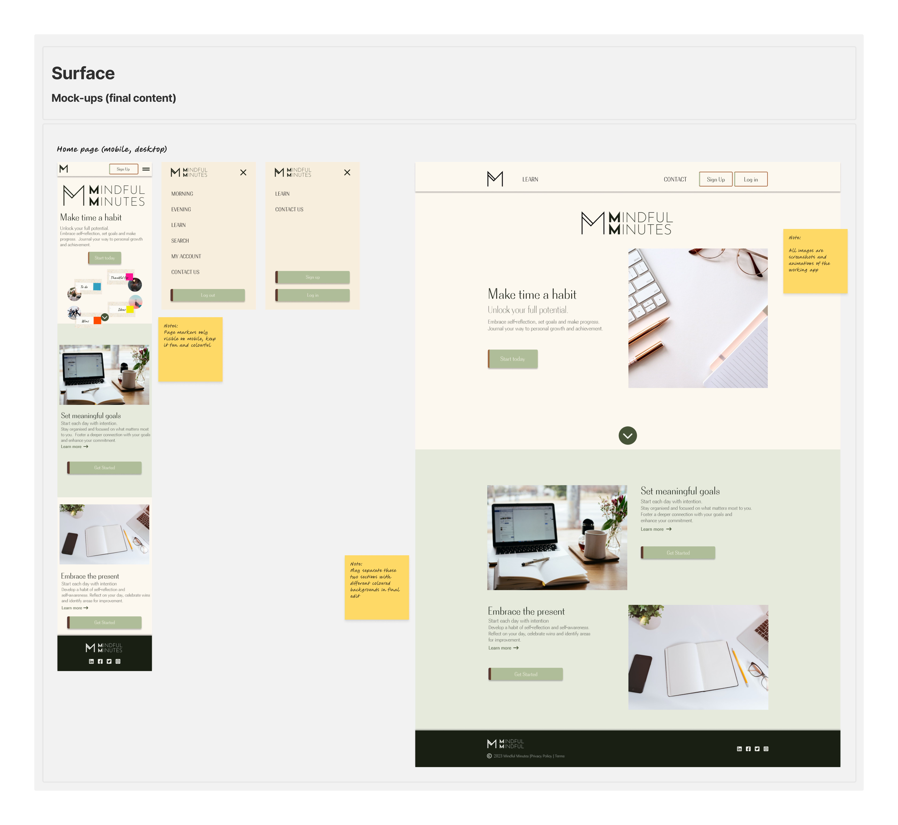

---

#### Forms

---

#### Morning page (and Evening page)

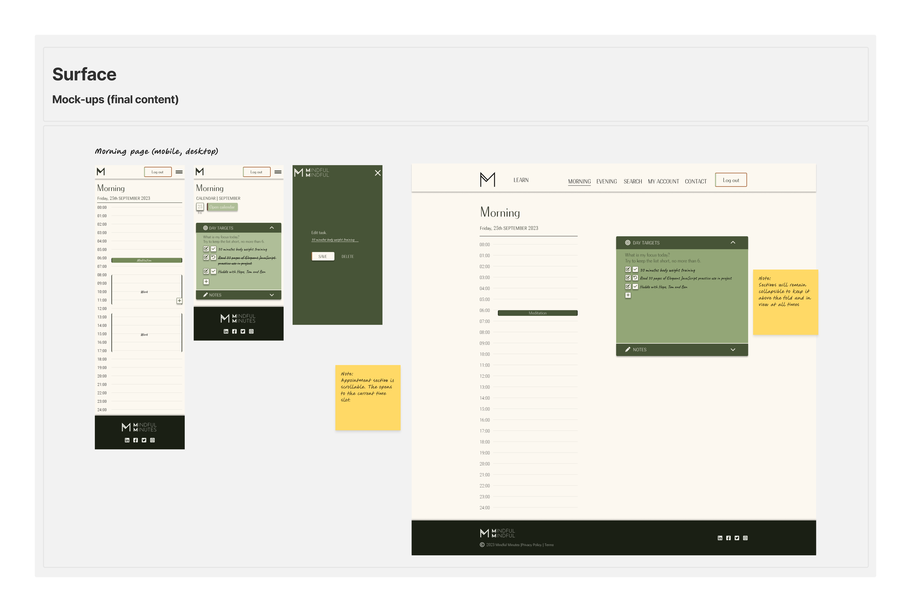

---

#### Search page

---

#### My profile page

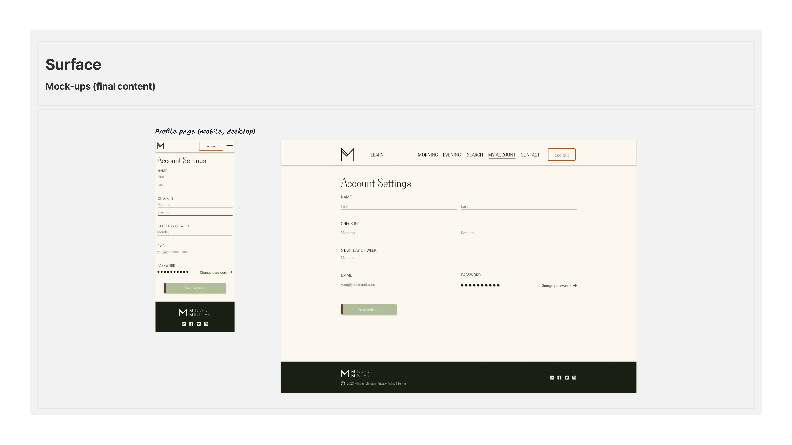

---

### References:

#### Methodology
- [UX Design using the Five Planes Method](https://medium.com/designcentered/ux-design-5-planes-method-b1b1d6587c05)

#### Images within Mock-ups:
- [Laptop and notepad by Nick Morrison](https://unsplash.com/photos/FHnnjk1Yj7Y)
- [White work table with notes, smartphone and laptop by JESHOOTS.COM](https://unsplash.com/photos/pUAM5hPaCRI)

---

#### Design Inspiration:
- [Click Up](https://clickup.com/)
- [Pinterest](https://www.pinterest.ch/)
- [Women Who Code + Codum Buddy Accountability Form](https://www.womenwhocode.typeform.com/)
  - [Typeform](https://www.typeform.com/)
- [Motion Recording App by Alan Love on Béhance](https://www.behance.net/gallery/124478219/Sports-Recording-app)

[Back to the top](#5-planes-of-design)